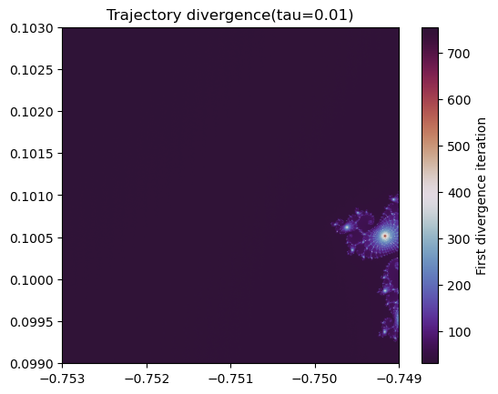
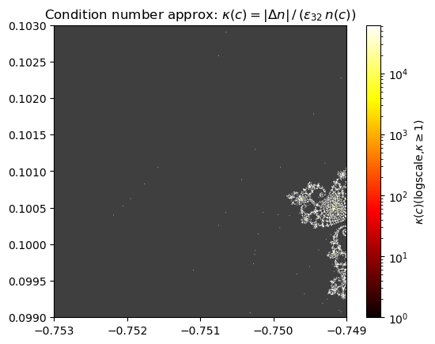

# L08 - Computer Arithmetics
L08 explains how numerical data is represented and why floating‑point arithmetic behaves differently from real numbers. It introduces two’s complement for integers and IEEE 754 float32, covering bit layout, exponent bias, normal/subnormal numbers, and spacing. It explains how precision limits cause non‑uniform gaps between representable values, leading to magnitude absorption. The topic highlights catastrophic cancellation, showing how subtracting nearly equal numbers destroys significant digits and how reformulating algorithms (e.g., Vieta’s fix for the quadratic formula) avoids this. Horner’s method demonstrates redesigning polynomial evaluation to prevent overflow and reduce error. Finally, the condition number quantifies sensitivity to input perturbations, explaining why the Mandelbrot boundary is numerically ill‑conditioned.

## Exercises
### Exercise 1 - Machine Epsilon
- [x] Find Machine Epsilon by Successive Halving
- [x] Compare to Standard Value

### Exercise 2 - Catastrophic Cancellation
- [x] Subtract Near-Equal Numbers
- [x] Observe Precision Loss

### Exercise 3 - Error Accumulation
- [x] Multiply Power of 10 by 0.1
- [x] Compute Relative Error
- [x] Observe Error Growth
---

## Milestones
### Milestone 1 - Trajectory Divergence
- [x] Compute Mandelbrot for both float32 and float64
- [x] Map the Divergence of the Implementations 

### Milestone 2 - Sensitivity Map
- [x] Compute Per-Pixel Condition Number
- [x] Compute Sensitivity Map

