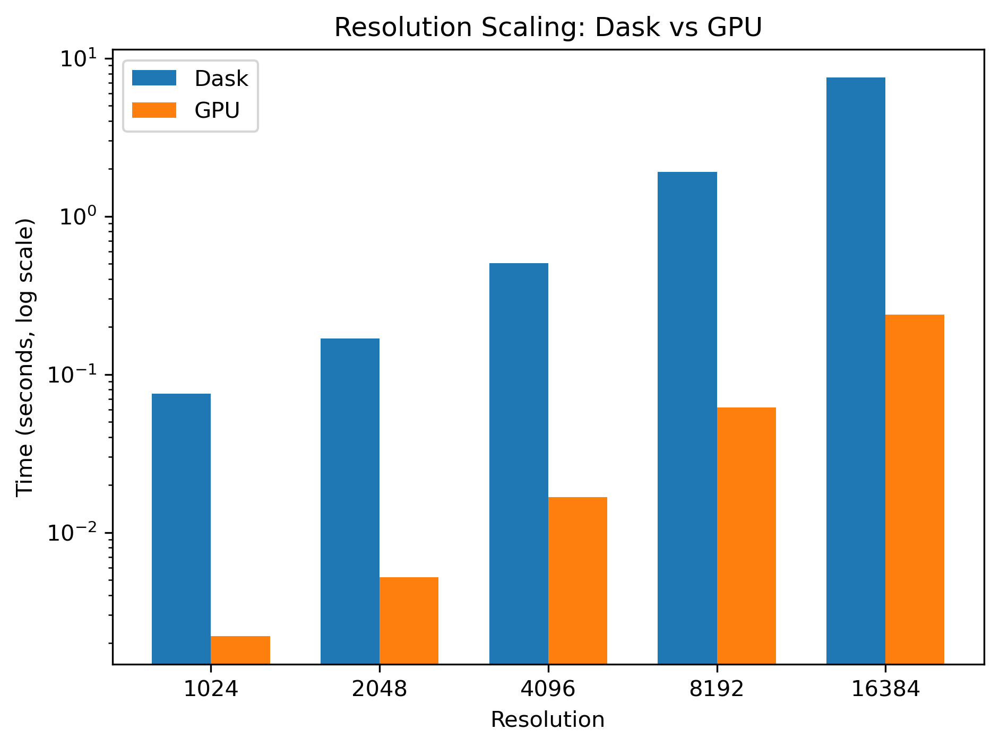

# L10 - GPU Computation
L10 introduces GPU architecture and when GPU acceleration is beneficial. GPUs provide massive parallelism with many simple cores, excelling at high‑arithmetic‑intensity workloads. L10 shows the OpenCL programming model: kernels, work‑items, work‑groups, NDRange, and the GPU memory hierarchy (global, local, private, constant). The Roofline model predicts whether a kernel is memory‑bound or compute‑bound and whether a GPU can outperform a CPU. OpenCL and CUDA share the same conceptual model, so skills transfer directly. The topic concludes with the workflow for writing GPU kernels in Python via PyOpenCL, including memory transfers, kernel compilation, and execution.

## Exercises
### Exercise 1 - Hello GPU
- [x] Check Available Compute Devices

### Exercise 2 - Vector Sum
- [x] Do Simple Computation
- [x] Verify Result
---

## Milestones
### Milestone 1 - Mandelbrot float32
- [x] Write the Kernel in C
- [x] Run the Mandelbrot Algorithm with float32 Precision

### Milestone 2 - float32 vs float64
- [ ] Run the Mandelbrot Algorithm with float64 Precision
- [ ] Compare Precisions
Copmute Device (Laptop GPU) does not support float64

### Milestone 3 - GPU Benchmark
- [x] Make a Bar Chart of all Implementations
- [x] Separate Bar Chart for Resolution Sweeps
---

## Results
### 1024 Resolution
This Implementation Compared to L07's Implementation, and L01's Implementation:

|Implementation|Compute Time|Speed-Up|
|:--|--:|--:|
|Naive (Baseline)         |3.56867 s|   1.000x|
|Dask Cluster (Week 7)    |0.07562 s|  47.192x|
|GPU Computing (This Week)|0.00220 s|1622.123x|

### Resolution Scaling
As the resolution goes up, we keep track of the decrease in compute time (Slow-Down):

|Implementation|Resolution|Compute Time|Slow-Down|
|:--|--:|--:|--:|
|Dask (Cluster)| 1024|0.0756 s|  1.000x|
|Dask (Cluster)| 2048|0.1683 s|  2.226x|
|Dask (Cluster)| 4096|0.5051 s|  6.681x|
|Dask (Cluster)| 8192|1.9059 s| 25.210x|
|Dask (Cluster)|16384|7.5696 s|100.127x|
|GPU Computing | 1024|0.0022 s|  1.000x|
|GPU Computing | 2048|0.0052 s|  2.363x|
|GPU Computing | 4096|0.0167 s|  7.591x|
|GPU Computing | 8192|0.0618 s| 28.091x|
|GPU Computing |16384|0.2379 s|108.136x|

