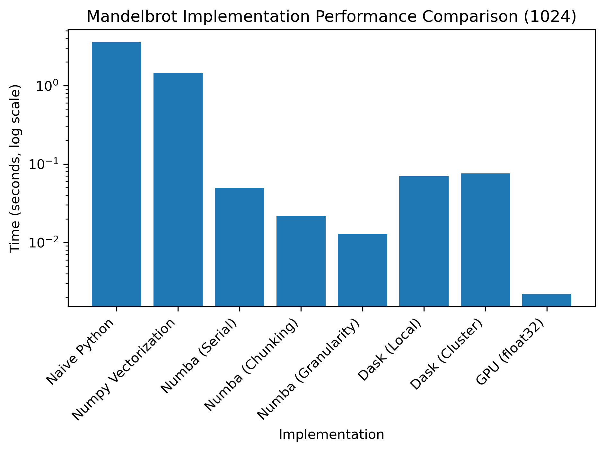

# Mandelbrot - Numerical Scientific Computing
In this project an implementation of the mandelbrot will be progressively optimized, from a couple of seconds to a few millisecond (upwards of 2000x speedup). This is achieved by applying vectorization, JIT compilation, parallel computing, distributed computing and finally GPU acceleration.
Going through the project includes practicing version control (Git), testing, documentation, and understanding numerical precision, building both performance optimization skills and software engineering fundamentals essential for computational science.

## Topics
### L01 - Intro & Development Tools
L01 sets up the development environment, introduces Git, and begins the naive Mandelbrot implementation. Focus is on reproducibility, workflow setup, and preparing for later optimization.

### L02 - Computer Architecture & Memory
L02 covers memory hierarchy, cache behavior, and access patterns. It motivates NumPy vectorization and shows how contiguous arrays and SIMD can enable speedups (2.468x) for Mandelbrot.

### L03 - Code Optimization & Profiling
L03 is about profiling, algorithmic intensity, and Numba JIT compilation. Identify bottlenecks, apply JIT for large speedups (72.036x), and compare float32/float64 performance.

### L04 - Parallel Computing I
Amdahl, Gustafson, and Work‑Span explain limits to parallel speedup. Multiprocessing with Pool.map() bypasses the GIL and parallelises Monte Carlo Pi and Mandelbrot. Measured speedups reveal the effective serial fraction.

### L05 - Parallel Computing II
Granularity and load imbalance dominate multiprocessing performance. Using more chunks than workers improves balance. Graham’s Bound and LIF quantify imbalance. Mandelbrot fits the map‑reduce-reduce pattern, and tuning chunk count gives better speedup.

### L06 - Distributed Computing with Dask (Local)
Distributed computing introduces network latency and scheduler overhead. Dask uses lazy task graphs and a LocalCluster to parallelise Mandelbrot. Chunk‑size sweeps reveal the balance between overhead and parallelism.

### L07 - Distributed Computing with Daks (Cluster)
Dask moves from LocalCluster to Strato with only a Client‑line change. Network latency requires larger chunks. The topic goes over OpenStack basics, setting up a cluster, running Mandelbrot, and recording cluster‑scaling results.

### L08 - Computer Arithmetics
How numbers are stored affects accuracy. Float32 has non‑uniform spacing, causing rounding and cancellation issues. Stable reformulations (Vieta, Horner) avoid precision loss. Condition numbers explain why the Mandelbrot boundary is ill‑conditioned.

### L09 - Testing & Documentation
Reliable scientific code requires tests, clear docstrings, and type hints. Pytest enables structured verification, while MyPy checks consistency. These practices improve correctness and maintainability.

### L10 - GPU Computing
GPUs excel at massively parallel, compute‑heavy tasks. OpenCL defines kernels, work‑items, and memory hierarchy. The Roofline model predicts when GPUs help. OpenCL concepts map directly to CUDA.

## Performance Table
All benchmarks has been computed by having a warm up run, and then taking the median of 5 runs afterwards.

Parameters for Consistent Comparison:
|Resolution|Max Iter.|Esc. Bound|Region(x)|Region(y)|
|:-:|:-:|:-:|:-:|:-:|
|1024x1024|100|2.0|(-2.5, 1.0)|(-1.5, 1.5)|

### All Implementation
Performance table for each implemenatation of the Mandelbrot, computed through the parameters described above:

|Implementation|Compute Time|Speed-Up|Total Speed-Up|
|:--|--:|--:|--:|
|Naive Python       |3.56867 s| 1.000x|   1.000x|
|NumPy Vectorization|1.44573 s| 2.468x|   2.468x|
|Numba (Serial)     |0.04954 s|29.183x|  72.036x|
|Numba (Chunking)   |0.02190 s| 2.262x| 162.953x|
|Numba (Granularity)|0.01294 s| 1.692x| 275.785x|
|Dask Local         |0.06986 s| 0.185x|  51.083x|
|Dask Cluster       |0.07562 s| 1.281x|  47.192x|
|GPU Computing      |0.00220 s|34.373x|1622.123x|

Bar chart combining each of the times from the performance table above. The bar chart is show at log-scale, due to the large increase over each of the implementations:

### Resolution Scaling
Some of the implementations are so quick that a resolution scale has been done to do them justice.
As the resolution goes up, we keep track of the decrease in compute time (Slow-Down):

|Implementation|Resolution|Compute Time|Slow-Down|
|:--|--:|--:|--:|
|Dask (Cluster)| 1024|0.0756 s|  1.000x|
|Dask (Cluster)| 2048|0.1683 s|  2.226x|
|Dask (Cluster)| 4096|0.5051 s|  6.681x|
|Dask (Cluster)| 8192|1.9059 s| 25.210x|
|Dask (Cluster)|16384|7.5696 s|100.127x|
|GPU Computing | 1024|0.0022 s|  1.000x|
|GPU Computing | 2048|0.0052 s|  2.363x|
|GPU Computing | 4096|0.0167 s|  7.591x|
|GPU Computing | 8192|0.0618 s| 28.091x|
|GPU Computing |16384|0.2379 s|108.136x|

